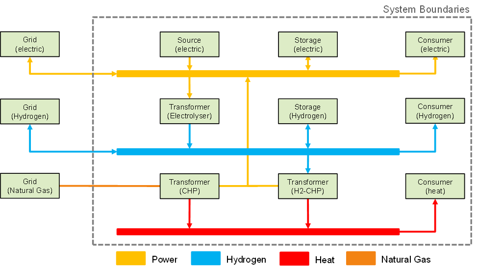

======
Manual
======

This page contains the main manual of the DBI-MAT tool.
Therefore, the manual describes at first the main purpose of the tool.

Main description of the tool
------------
Overview
....................
The **DBI-MAT (Microgrid Analysis Tool) is an energy system modelling and optimization tool** which is used to model local energy systems (hereinafter called microgrids) with all included energy and process streams between the main components of the system. As components all plants are meant which provide, transform, store, or use energy or mass streams. The framework is built to solve the energy and process streams so that energy and mass conservation is given at any time in the calculation. Therefore, the solver can control several elements of the system within pre-defined limits. If no solution can be found the operating ranges must be adjusted. If the technical system is solved an economical calculation can be performed. This calculation includes the determination of annuities of new investments and the operational costs of all in the system contained components and streams exchanged with the system boundaries. Based on this solution algorithm a structure optimization can be performed. That the defined structure of the energy system can be modified by adding, removing, or reconnecting components in the defined system. The optimizer modifies the components in the range of user defined degrees of freedom, which could be for example storage capacity or electrical power, to get optimized results for defined objective functions. On the other hand, the model also can be used to optimize the operation mode of included plants by prioritizing components. The definition of an objective function as well as the decision for optimization algorithms may be chosen individually for each project/szenario. Systems can easily be defined as black box functions and handed to external solvers.
Overall, the tool is built of one or more balance groups, which are used to provide mass conservation. The example system in Figure 1 contains three balance groups (power, hydrogen, and heat). Several components can be linked to these balance group. Therefore, it is important which major type of the component is linked. There are five main classes with different calculation methods and attributes. These classes are sources, sinks, transformers, storages, and grids. The detailed descriptions of the classes are provided in the class code itself.

Figure 1: Example system solved by DBI-MAT

Temporal and Spatial resolution
....................
The DBI-MAT tool does not provide any spatial resolution. The microgrids which are analyzed using the tool are local microgrids in which the transport of mass or energy can be assumed as nearly lossless. The tool does not contain any transportation components to model transportation including losses.

The tool works with different temporal resolutions. The temporal resolution is defined by the load profiles which are set as an input of the system. Typical temporal resolutions which have been used in previous projects are between 15 and 60 minutes. Even if the temporal resolution can be chosen freely, attention must be paid on the influences of technical detail. A high resolution leads to an higher influence of other technical correlations which must be implemented then. For example, would be the implementation of start-up and shutdown curves essential if a calculation of an electrolyser with a temporal resolution of one minute is aspired.

Application purpose of DBI-MAT
....................
The DBI-MAT tool was developed to analyze and optimize local energy systems. It is used to determine optimized scenarios to integrate renewable energy sources, hydrogen applications and other processes in an economical and ecological feasible way. Therefore, the tool contains several methods and components to develop an efficient system using sector coupling. In previous project the focus was mainly set on integration of hydrogen by determining and implementing technical and economical parameters and calculation methods for electrolysers, hydrogen storages and hydrogen consumers.

Program sequence
----
Flow chart
....................
This chapter contains the basic run sequence of the DBI-MAT tool. Therefore, the sequence is visualized in the given Figure 2 (**click on Figure to enlarge**). At the beginning of the DBI-MAT a system definition for the techno-economical system must be worked out. How this system definition works is further described in the chapter **inputs\System definition**. If the system definition is given an initialization process will be started. This process interacts with the DBI-MAT database, loads all the necessary data, checks the possibility of connections and recognizes open ports of components. If the initialization process finished without any critical error, we get an fully initialized model which now can be used to perform the two already mentioned calculation methods for technical calculation (**ModelBase.run()**) and for economical calculation (**ModelBase.calculate_costs()**). The flow chart of these two methods can be seen in Figure 2 (**click on Figure to enlarge**) and will not be further explained. To get additional information about the methods look at the documentation of the source code of the functions.

Figure 2: Schematic DBI-MAT flow chart for whole process

Code structure
....................

DBI-MAT is written in Python language and built in a generic, object oriented and modular structure. The code is written object-oriented which means that all technical calculations are implemented in the components themselves so that they are intrinsic solvable. This method has three main advantages, which are:

* high flexibility in connecting components
* high flexibility in defining modes of operation
* high flexibility in defining optimization goals/ objective functions
* easy maintainability

The framework of the tool allows the user to easily add components and link them to one of the defined balance groups without modifying the internal calculations which makes it easy to model several types of microgrids and provide a high degree of flexibility. If the internal calculations of a component must be checked the object-oriented programming allows an easy maintainability as only selected classes have to be edited. The mentioned framework allows a consequent development of the tool by easily adding new components with new calculation methods. The internal calculations of new components can thirst be rudimentary and become more detailed if necessary, which corresponds to the approaches of a botton-up modelling.

Modelling of processes in DBI-MAT
....................

The DBI-MAT tool contains several types of processes which are included in the main class types described before:

**Source/Sink processes**: Predefined sources provide mass or energy to the balance group whereas sinks take mass or energy from the balance group. Therefore, these processes must have a profile or a maximum possible stream they are able to provide or take from the balance group.

**Transformation processes**: Transformation processes are all processes which are used to convert one type of energy/mass in another. They are used to link different balance groups. Therefore, these processes contain efficiencies and conversion rates to define all in- and outputs of the component.

**Storage processes**: Storage processes can take energy or mass from a balance group if surplus exists and provide it at another time when it is needed. Therefore, storages need at minimum a storage size, which describes how much energy can be stored temporarily.

**Grid processes**: The grid processes are used to link the local system to streams from outside the system boundaries. Those can work in one direction or bidirectional and the connection can be limited to a certain amount of energy or mass at any time.

Inputs
----

Overall
....................

The necessary input of DBI-MAT can be seen on the left side of Figure 3. At first user must define all components that are included in the microgrid. When these components are initialized, further component-specific parameters must be passed to the initialization process to define the component. That can be the installed storage capacity or the installed electrical power. After all components are initialized, their ports, which define an in- or output must be linked to a balance group. If special operating modes are required, the connected components be prioritized by defining a set of priorities. This is as shown in Figure 3 the technical systems.

Figure 3: Schematic DBI-MAT chart

Apart from the technical system the tool also accepts load profiles to define limitations for the in- and output of the microgrid. The tool can handle different profile lengths and time resolutions. The combination of profile length and time resolution describes which time window is calculated and in which detail. These profiles can contain different types of information. For example, also the electrolyser as a transformer can be run with a profile. In this case the profile is used as the electrical input of the electrolyser. That allows a high flexibility, because the transformer components don’t have to be defined by provided in- or output.

A third necessary input is the database file, which is included in the model. This file contains technical parameters such as efficiencies of different converter types and economical parameters such as specific investment costs for a technology type. These parameters are collected from literature research and DBI expertise.

Database
....................
The DBI-MAT model has a connection to an SQL Database which is run on the DBI-Server. The database is used to load necessary information about the composition of all possible mass streams in the model. The database also includes basic efficiency data which is used to calculate the transformation of mass and energy via Converter modules. Additionally the database includes economical data for several components which can be used to make a first approximation of costs if no concrete data is available. The connection with the database can be found in base/model_base/database_connection.

System definition
....................
A template of the system definition can be found in use_case_template folder. Some example systems are described in the test_case folder. The system definition as a special syntax but basically you define any number of components and connect them to branches. Afterwards you implement profiles and priority rules to define the interaction between the components. A list of all possible components can be found in base/source/modules.

Outputs
----

The DBI-MAT tool generates two types of data outputs as data structures. The first one is the technical solution for mass and energy flow in the system. It contains all exchanged streams in form of a dictionary of profiles for all energy and mass streams between the components at any timestep. Additionally, the tool outputs main status parameters of the components such as storage level or electrolyser load for each timestep.

The second main output is the economical output, which is the result of a second, optional calculation. This output is also a data structure including several economical parameters. It includes the investment costs of all main new investments which are necessary. It also contains the annuities resulting from these investment costs, the life cycle and the interest rate. These are the capex of the microgrid, which are stored for each component. These components also have operational costs resulting for example from maintenance. The whole microgrid may contain operational costs or revenue which result from buying or selling commodities over the system boundary. These costs or revenue are also part of the data structure.

Additional to the single run output of the system the optimization provides several other output formats. Due to the free choice of optimization algorithms and objectives any optimization data can be provided. Figure 4 shows an example output generated with DBI-MAT and an grid search optimization approach.

Figure 4: Example optimization output

The program also aids the user in debugging through specific standardized warnings and error messages, which are printed out in the terminal while running. The logfile of these logging messages is also an output of the model and can be used for the evaluation of inputs and solutions.
